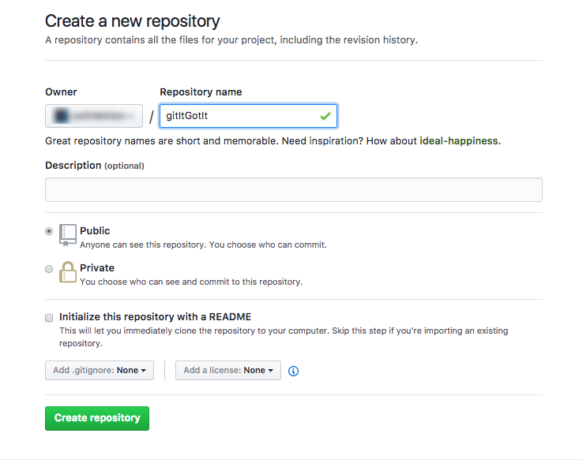
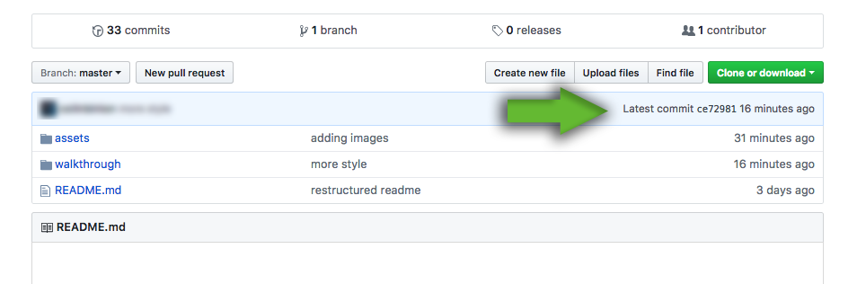
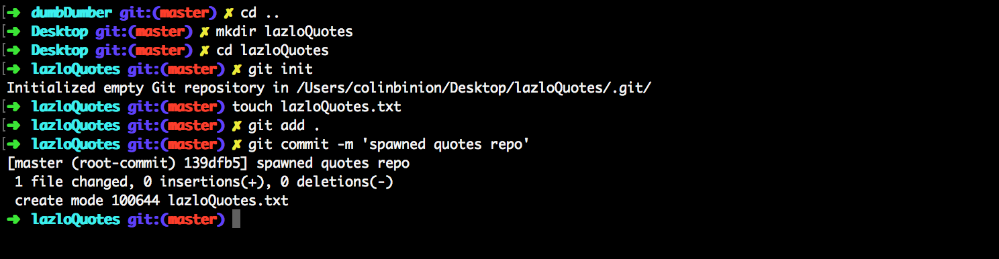
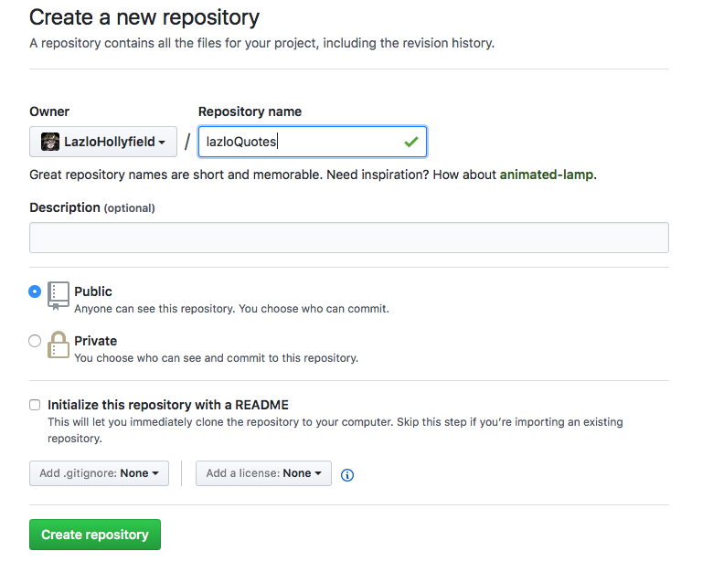
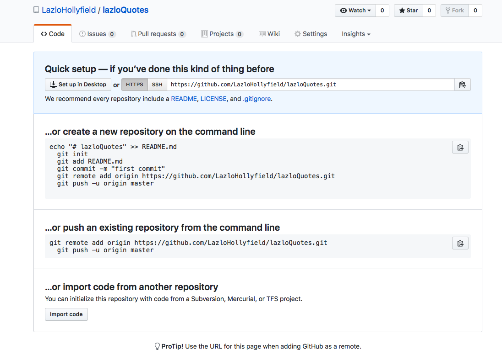
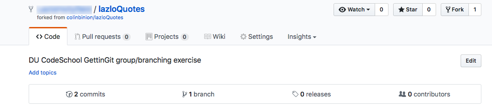
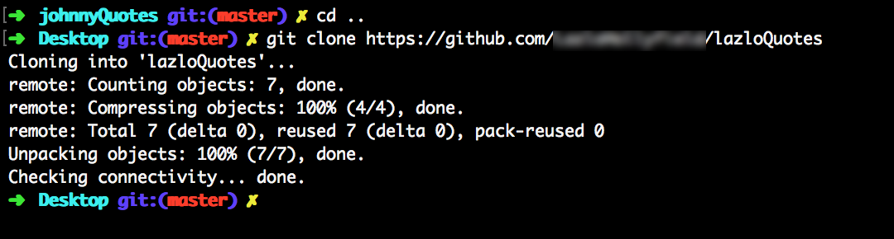
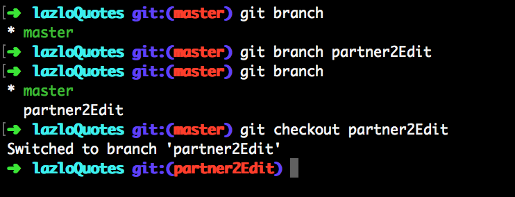
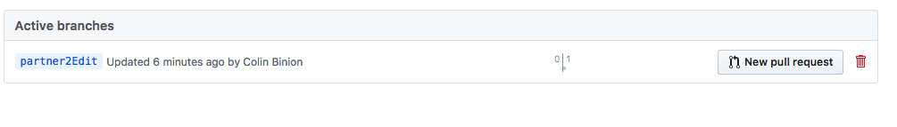
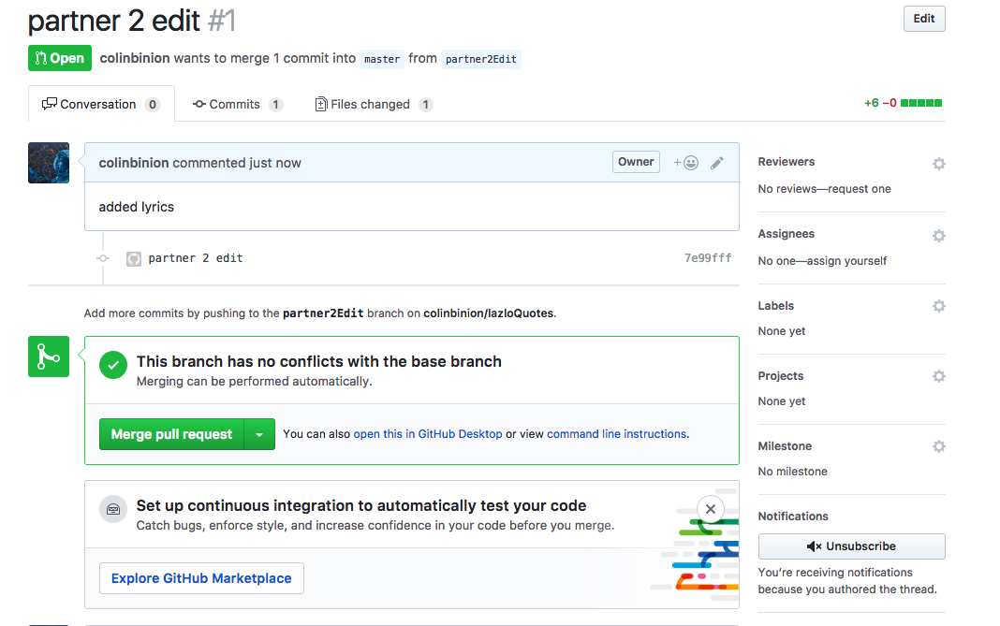

# GettinGit Tutorial

---

# Some Essential Git Concepts
### To create a new git repository
`$ git init`

*This CLI command creates a new local (on your machine) repository.*

### Repo Status
`$ git status`

*This checks the status of the current repository & shows what files have changed.*

`$ git diff`

*Shows differences/contrasts between the working tree and the latest commit.*

### Repo History
`$ git log`

*Shows all the commits on the current branch. Beginning with the most recent commit.*

`$ git log --oneline --decorate --color --graph --all`

*Illustrates the **full tree history** with a commit graph. This may be easier to read than a `$ git log`*

### Stage files to commit
`$ git add <yourFilename>`

*Add a file and its changes to the staging area.*

`$ git add -A`

*Add all files and changes to the staging area.*

### Commit changes in staged files
`$ git commit -m "<your commit message>"`

*commit staged changes (the `-m` flag will add your commit message inline).*

### Branching off your master branch
`$ git branch <your new branch name>`

*this creates a new branch*

`$ git branch`

*list all branches*

`$ git checkout <your branch name>`

*this switches to a different branch*

### Merging your branches

`$ git merge <your branch name>`

*merge target branch into  current branch.  You will need to checkout your master branch (or desired branch) before running this command.  This command merges the identified branch into the branch you are currently in.*

---

# How to initialize a git repository
**Step One**

*Make a directory*

`$ mkdir <dir name>`

**Step Two**

*Move into the repository*

`$ cd <dir name>`

**Step Three**

*Initalize a git repository*

`$ git init`

---

# Some basic git workflow
*1. **Start** by doing a little bit of work/coding*

*2. **Next** take a second to review your changes you've made*

`$ git status`

*3. **Next** add files to the staging area. (Use `$ git add -A` to add all files and changes.)*

`$ git add <your filename>`

*4. **Next** review what you're about to commit*

`$ git status`

*5. **Finally** commit the changes in the staging area with a message.*

`$ git commit -m "<message>"`

**Note:** You would normally `$ git push` as the next step, however at this point in the walkthrough we haven't added the gitHub repo bindings

---

# Creating/Managing your local repo
### This exercise will reside on your device and not add to a gitHub repo
1. Let's create a new directory in the terminal with the name of your **favorite movie**. (Make sure you `cd` into that directory)
2. Next initialize a local git repository.  (See notes above)
3. Next create a new html file and call it `index.html`
4. Let's check the status of your local repo. Confirm that your new file exists and has not yet been added to your local repo.  (See notes above)
5. Let's add index.html to your staging area.  (See notes above)
6. Let's commit index.html to your local repo with the message "created initial homepage". (See notes above)
7. Next open the file in Sublime and set up your html doc structure. (head, body, title, etc.)
8. Let's check the status of your local repo to view your changes.  (See notes above)
9. Let's add your changes to the staging area.  (See notes above)
10. Next check the status and confirm that your changes have been added to the staging area. (See notes above)
11. Now commit the changes to your local repo with the message "initial html doc structure".  (See notes above)
12. Go ahead and repeat steps 7-11, but add a header to your page this time. Commit these changes with the message "adding index.html header".
13. Now repeat steps 7-11, adding an image of the movie poster. Think about what your commit message should be.
14. Repeat steps 7-11 one more time, add three trivia facts about the movie in an ordered list.
15. Finally run the git log command (`git log --oneline --graph --decorate --all`) to see your local commit history. You should see 5 commits. (See notes above)

---

# Working with a remote repository (gitHub)

`$ git clone <repo path or URL>`

*This clones a repository into a new directory on your local machine*

`$ git remote`

*This lists the remotes for the current repo*

`$ git remote add <remote name> <remote path or URL>`

*This adds a remote to your repo.  A <remote name> example is origin*

`$ git pull <remote name> <branch name>`

*This pulls down any change from a remote and meshes them into your repo. Under the hood it fulfills `git fetch` and then `git merge` commands*

`$ git push <remote name> <branch name>`

*This sends your local project changes to the remote to be merged*

---

# Creating/Managing the Remote Repository (gitHub)
1. In your browser log into your gitHub account
2. Create a repo on gitHub with the name of **gitItGotIt**, don't initialize README.

3. Copy the repo URL
4. In the **terminal** add the gitHub repo remote for your local repo.  Name the gitHub repo `origin`
5. In **terminal** push local commits up to gitHub
6. Go back your **browser gitHub repo** to confirm that your commits were pushed to the gitHub repo
7. In **Sublime** add a little trivia about your favorite actor/actress in the movie to your `index.html`
8. Add and commit the changes with the message "Favorite Actor/Actress"
9. Verify your repo status
1. Push/update to gitHub
1. Verify that the latest commit is there by looking at the commit history on gitHub.

1. In **Sublime** add another movie poster image
1. Check your repo status
1. Add and commit the changes with the message "moviePoster2"
1. Push/update to gitHub

**Note:** Make sure to use the `$ git pull` command when working with a group.  This will keep your local repo up to date and prevent merge conflicts.

# Collaborating with gitHub
### Setup
1. Partner up with two of your classmates to make a team of three
2. Discuss and decide who will be partner1, partner2, partner3

### First
Everyone:

1. `cd ..` out of your movie directory and create a new directory called `<your first name>Quotes`.  
2. Move into the new directory and initialize a git repo.
3. Create a new file `<your first name>Quotes.txt`
4. Add the file to be tracked and commit with the message 'spawned quotes repo'
5. In **Sublime** write your first quote in the `<your first name>Quotes.txt` file

6. In **terminal** add the file tracking and commit with the message 'first quote by [your first name]'
7. In your **browser** go to gitHub and create a repo called `<your first name>Quotes`

8. Add the new gitHub repo as a remote called `origin`

9. Push your local commits up to gitHub.
10. Verify that your commits are on gitHub.

**Wait for you team to finish this section before moving forward**

### Next Steps
1. Partner1, go to partner2's <your first name>Quotes gitHub repo and **fork** it. Partner2, do this to partner3's repo. Partner3, do it to Partner1's repo.

2. Clone the new forked repo (the url should have your username in it) to your computer

1. In your **terminal** create a new branch and checkout the new branch

3. Open your partner's <first name>Quotes.txt file and add a new quote to it
4. In your **terminal** add/stage and commit the changes with the message '<first name> added quote'
5. Push to gitHub. Your change should now be seen in **your** forked repo.

6. Click the green pull-request button. Review the changes. Click "Create Pull Request".
7. Title your pull request and comment. Click "Create Pull Request" to submit a pull-request to you partner.

You've submitted your first pull-request

**Wait for you team to finish this section before moving forward**

### After That
1. Go to ***your*** <first name>Quotes gitHub repo. You should see a pending pull-request from your partner. Review the pull-request.  Accept it if things look good

You've accepted your first pull-request

**Wait for you team to finish this section before moving forward**

### Finally
1. Repeat steps in Part 2 and Part 3, for your other partner's repo. Add the final quote to <first name>Quotes.txt
2. Now all three partners should have a complete <first name>Quotes.txt authored with two collaborators

---

# Resources
Github Guides - https://guides.github.com/
Github Training Videos - https://www.youtube.com/user/GitHubGuides
Git for Ages 4 and Up (Video) - https://www.youtube.com/watch?v=1ffBJ4sVUb4  
Pro Git (free e-book) - http://git-scm.com/book  
Try git - https://try.github.io  
A Practical Git Introduction - http://mrchlblng.me/2014/09/practical-git-introduction/  
Git Branching Game - http://pcottle.github.io/learnGitBranching/  
